<!--
  SOHAN KHACHANE — GitHub Profile README
  Repo name must match username exactly: Sohan1606
  SVGs alongside: avi-ascii.svg, wordmark.svg, contrib-heatmap.svg
-->

<div align="center">

<h3><code>sohan-khachane@github ~ $ whoami</code></h3>

<table>
<tr>
<td valign="top"></td>
<td valign="top"></td>
</tr>
</table>

<br>

**Cloud · DevSecOps · Full-Stack · Systems Engineering**

*Building real infrastructure. Shipping real products. Making it public.*

<br>

[](https://sohan-portfolio-six.vercel.app)
[](https://www.linkedin.com/in/sohan-khachane)
[](https://www.instagram.com/sohan.khachane)
[](https://youtube.com/@entertainmint1100)
[](https://www.facebook.com/share/1L68QPaXWT/)
[](https://vues.app/@user61740767)

</div>

---

<div align="center">
<h3><code>sohan-khachane@github ~ $ cat about.txt</code></h3>
</div>

```yaml
name:       Sohan Khachane
university: University of Mumbai
focus:      Cloud Infrastructure · DevSecOps · Full-Stack Engineering
building:   memory-os | sentra | ResQLink | lastkey-digital-legacy
status:     Final Year CS · Open to SWE Internships & Graduate Roles
motto:      "Real repos. Real deploys. No fake metrics."
```

---

<div align="center">
<h3><code>sohan-khachane@github ~ $ cat stack.txt</code></h3>
</div>

**Cloud & DevSecOps**


**Full-Stack**


---

<div align="center">
<h3><code>sohan-khachane@github ~ $ ls -la projects/</code></h3>
</div>

<details>
<summary><b>🧠 memory-os</b> — Personal memory & OS-level productivity system <em>[In Progress]</em></summary>
<br>

> An operating-system-style layer for managing personal memory, tasks, and context — built with cloud-native architecture.

| Aspect | Details |
|--------|---------|
| Stack | JavaScript · Node.js · Cloud |
| Type | Developer Productivity · SaaS |
| Status | Active Development |
| Repo | [Sohan1606/memory-os](https://github.com/Sohan1606/memory-os) |

</details>

<details>
<summary><b>🚨 Sentra</b> — MERN Incident Reporting Dashboard for Institutions</summary>
<br>

> Role-based incident reporting and response system for educational institutions. Students, staff, and admins each see a tailored view with secure reporting, real-time status tracking, and admin management.

| Aspect | Details |
|--------|---------|
| Stack | MongoDB · Express · React · Node.js (MERN) |
| Features | Role-based access · Status tracking · Admin panel |
| Repo | [Sohan1606/sentra-incident-dashboard](https://github.com/Sohan1606/sentra-incident-dashboard) |

</details>

<details>
<summary><b>🔑 LastKey</b> — Digital Legacy App</summary>
<br>

> A digital legacy management system — securely store and pass on critical information, accounts, and memories to trusted people.

| Aspect | Details |
|--------|---------|
| Stack | JavaScript · Full-Stack |
| Purpose | Digital inheritance · Secure data handoff |
| Repo | [Sohan1606/lastkey-digital-legacy](https://github.com/Sohan1606/lastkey-digital-legacy) |

</details>

<details>
<summary><b>🆘 ResQLink</b> — Emergency Response Platform</summary>
<br>

> Connects people in emergency situations with the nearest responders — real-time location-based alert system.

| Aspect | Details |
|--------|---------|
| Stack | JavaScript · Real-time APIs |
| Domain | Emergency Tech · Public Safety |
| Repo | [Sohan1606/ResQLink](https://github.com/Sohan1606/ResQLink) |

</details>

<details>
<summary><b>☁️ Cloud Complaint System</b> — Cloud-hosted complaint management</summary>
<br>

> A cloud-deployed complaint and grievance tracking system built with scalability in mind.

| Aspect | Details |
|--------|---------|
| Stack | JavaScript · Cloud Infrastructure |
| Repo | [Sohan1606/cloud-complaint-system](https://github.com/Sohan1606/cloud-complaint-system) |

</details>

---

<div align="center">
<h3><code>sohan-khachane@github ~ $ ./contributions.sh</code></h3>


</div>

---

<div align="center">

<h3><code>sohan-khachane@github ~ $ cat focus.yaml</code></h3>

```yaml
currently_building:
  - memory-os (cloud-native personal OS layer)

learning:
  - DevSecOps pipelines
  - AWS Solutions Architecture
  - System design at scale

open_to:
  - SWE Internships (2026)
  - Graduate roles (Cloud / Full-Stack / DevSecOps)
  - Open-source collaborations
  - Freelance builds

find_me:
  portfolio:  https://sohan-portfolio-six.vercel.app
  linkedin:   https://linkedin.com/in/sohan-khachane
  instagram:  https://instagram.com/sohan.khachane
  youtube:    https://youtube.com/@entertainmint1100
  facebook:   https://facebook.com/share/1L68QPaXWT
  vues:       https://vues.app/@user61740767
```

</div>

---

<div align="center">

*"Real repos. Real deploys. No fake metrics."*

<br>


</div>
